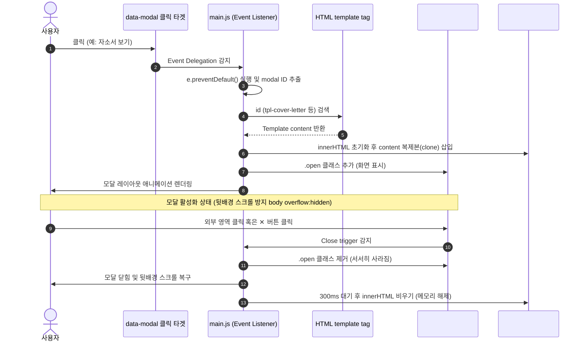
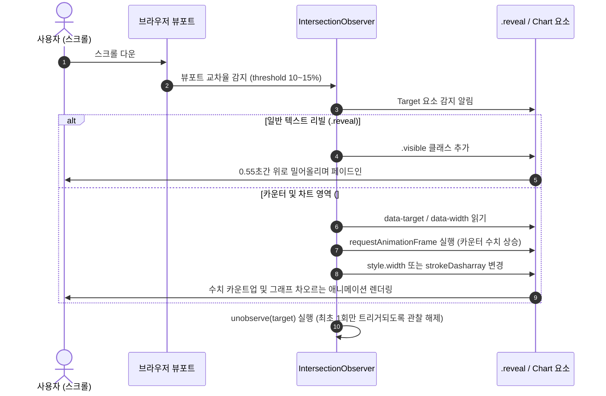

# Portfolio Component Architecture (COMPONENTS.md)

본 문서는 유용완 채용대행 PM 포트폴리오의 **컴포넌트 구조 및 인터랙션 다이어그램**입니다. 정적 HTML 요소를 구조적으로 모듈화하고, 각 영역이 자바스크립트 이벤트 및 모달 시스템과 어떻게 유기적으로 동작하는지 나타냅니다.

---

## 1. 컴포넌트 계층 구조 (Component Hierarchy)

웹 페이지의 전체 구조는 아래와 같이 단일 레이아웃 위에 독립적인 섹션(Section) 컴포넌트와 전역 인터랙션 시스템(Modal Subsystem)으로 구성됩니다.

```mermaid
graph TD
    %% Base Layout
    Main[index.html Layout] --> Nav[Navigation Bar]
    Main --> Hero[Hero Section]
    Main --> About[About Section]
    Main --> Ach[Key Achievements]
    Main --> Career[Career Timeline]
    Main --> Proj[Key Projects]
    Main --> Skills[Skills & Tools]
    Main --> Edu[Education Section]
    Main --> Contact[Contact Section]
    Main --> Foot[Footer]
    Main --> ModalOverlay[Global Modal Overlay]

    %% Navigation Details
    Nav --> NavLogo[YYW Monogram Brand]
    Nav --> NavLinks[Desktop/Mobile Menu Links]
    NavLinks -.-> |Anchor Jump| Hero
    NavLinks -.-> |Anchor Jump| About
    NavLinks -.-> |Anchor Jump| Career
    NavLinks -.-> |Anchor Jump| Proj
    NavLinks -.-> |Anchor Jump| Skills
    NavLinks -.-> |Anchor Jump| Edu

    %% About Details
    About --> AboutDesc[Intro Biography]
    About --> CoverLetterTrigger[Read Cover Letter Button]
    About --> KPICards[KPI Cards Stack]
    KPICards --> KPI1[Tenure Stat]
    KPICards --> KPI2[Annual PM Projects]
    KPICards --> KPI3[CS Score - Highlighted]

    %% Achievements Details
    Ach --> AchDash[Dashboard Grid]
    AchDash --> AchCard1[Tender Success Rate - Highlighted]
    AchDash --> AchCard2[Contract Expansion Bar Chart]
    AchDash --> AchCard3[Validation Time Comparison]
    AchDash --> AchCard4[Target Ratio Gauge Chart]

    %% Projects Details
    Proj --> ProjGrid[Projects Grid 2x2]
    ProjGrid --> P1[Story 1 Card]
    ProjGrid --> P2[Story 2 Card]
    ProjGrid --> P3[Story 3 Card]
    ProjGrid --> P4[Story 4 Card]
    Proj --> CSTrigger[View CS Interview Button]

    %% Skills Details
    Skills --> SkillBars[Skill Gauge Bars]
    Skills --> RadarChart[Competency Radar Chart]
    Skills --> CertCards[Credential Cards Grid]
    CertCards --> Cert1[ADsP Card]
    CertCards --> Cert2[Social Survey Card]
    CertCards --> Cert3[Excel Card]
    CertCards --> CertZoomTrigger[Credential Bundle Card]

    %% Global Modal Overlay Details
    ModalOverlay --> ModalPanel[Modal Panel Wrapper]
    ModalPanel --> ModalCloseBtn[Close Button]
    ModalPanel --> ModalBodyContent[Dynamic Body Area]
```

---

## 2. 동적 인터랙션 및 데이터 흐름 (Behavior & Interaction)

### A. 모달 제어 흐름 (Modal Control Flow)
사용자가 `data-modal` 속성을 갖는 버튼을 클릭했을 때 HTML 내에 선언된 `<template>` 엘리먼트를 활용하여 모달창을 띄우는 흐름입니다.

### B. 뷰포트 진입 감지 애니메이션 (Intersection Observer Flow)
사용자가 스크롤하여 특정 섹션에 도달했을 때 텍스트 리빌 효과 및 차트의 차오르는 그래프 효과를 트리거하는 시스템입니다.

