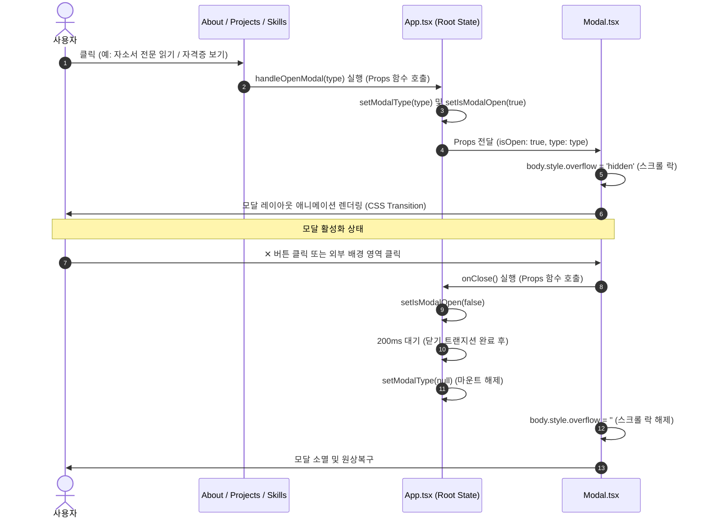
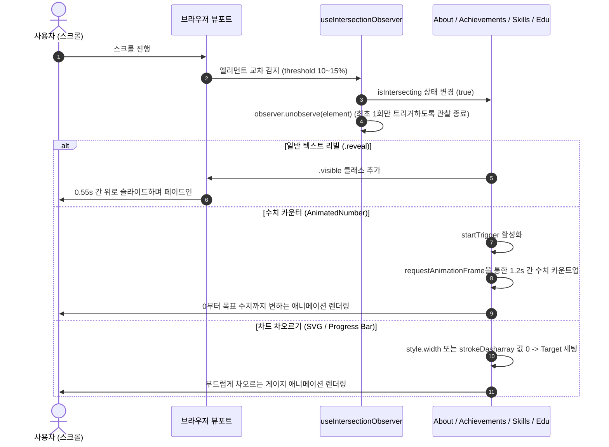

# Portfolio Component Architecture (COMPONENTS.md)

본 문서는 유용완 채용대행 PM 포트폴리오의 **React 컴포넌트 구조 및 인터랙션 다이어그램**입니다. Vite + TypeScript 환경에서의 컴포넌트 계층, State 및 훅(Hook)의 흐름을 정의합니다.

---

## 1. React 컴포넌트 트리 (Component Hierarchy)

웹 페이지의 전체 구조는 `src/App.tsx`를 루트로 하여 독립적인 UI 컴포넌트로 세분화되며, 전역 모달 상태(`isOpen`, `modalType`) 및 트리거 함수(`onOpenModal`)를 자식 컴포넌트에 Props로 공유합니다.

```mermaid
graph TD
    %% App root
    App[App.tsx - Root State] --> Nav[Navigation.tsx]
    App --> Hero[Hero.tsx]
    App --> About[About.tsx]
    App --> Ach[Achievements.tsx]
    App --> Career[Career.tsx]
    App --> Proj[Projects.tsx]
    App --> Skills[Skills.tsx]
    App --> Edu[Education.tsx]
    App --> Contact[Contact.tsx]
    App --> Foot[Footer.tsx]
    App --> Modal[Modal.tsx - Global Popups]

    %% Shared function / state flows
    About -.-> |onOpenModal| App
    Proj -.-> |onOpenModal| App
    Skills -.-> |onOpenModal| App
    App -.-> |Props: isOpen, type, onClose| Modal

    %% Component Details
    Nav --> MobileMenu[Mobile Menu State]
    About --> CountUp[AnimatedNumber Counter]
    About --> KPIProgress[KPI Progress Bars]
    Ach --> DonutSVG[Bid Success Donut Chart]
    Ach --> BarCompare[Contract Expansion Chart]
    Ach --> LineCompare[Time Reduction Line Chart]
    Ach --> GaugeSVG[Target Ratio Gauge Chart]
    Proj --> ProjGrid[Projects Grid 2x2]
    Skills --> SkillBars[Skill Range Bars]
    Skills --> RadarSVG[Competency Radar Chart]
    Skills --> CertCards[Cert Cards Grid]
    Edu --> GPABar[GPA Progress Bar]

    %% Assets
    Hero --> LogoAsset[Import logo_yyw.png]
    Modal --> CertSocialAsset[Import cert_social.png]
    Modal --> CertExcelAsset[Import cert_excel.png]
    Modal --> CertBadgesAsset[Import cert_badges.png]
```

---

## 2. 상태 관리 및 훅 제어 흐름 (State & Hook Flows)

### A. 전역 모달 상태 전달 (Modal Interaction Flow)
기존 HTML의 `<template>` 복제 방식 대신, React 컴포넌트의 단일 조건부 렌더링 스펙을 구현하여 메모리 누수를 방지하고 접근성을 대폭 향상했습니다.

### B. 뷰포트 진입 감지 및 애니메이션 (useIntersectionObserver Hook Flow)
`useIntersectionObserver` 커스텀 훅을 기반으로 개별 컴포넌트가 화면에 노출되는 순간을 감지하고, 이에 맞추어 차트 및 수치 카운트업을 자동으로 실행합니다.

